# TDD
~(The way of Richard)~


## End Game

Programming is the closest thing we have to magic. It allows you to create things with words.

-- Jenni Luckett


## End Game

- Reduce Monkey See, Monkey Do
- Programming with GUTs
- Better understanding of what we're doing with our testing


## End Game

When all I wanted was a *for* loop ...

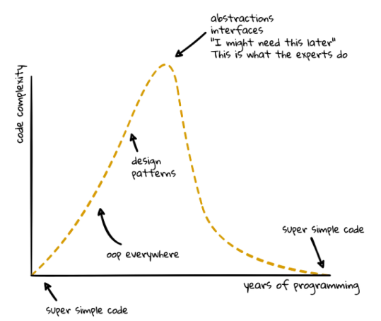


## End Game

I have yet to see a problem, however complicated, which, when you looked at it in the right way, did not become still more complicated.

-- Andersons Law


## TDD is dead. Long live Testing!

David Heinemeier Hansson - DHH (2014)


## Software Testing

Software Testing is a method to check whether the actual software product matches expected requirements and to ensure that software product is defect free.


## TDD Definition

Test Driven Development is software development approach in which test cases are developed to specify and validate what the code will do.


## Unit Test Definition

Unit Testing is a type of software testing where individual units or components of a software are tested.


## But first an intermission

A thought experiment...


### As a restaurateur, I want to put an Elephant in a fridge.

How would you fit an elephant into a fridge?


## Some questions you may ask yourself

- What fridge are we talking about?

- What kind of elephant are we talking about?

- If the elephant is too huge to fit into the fridge, what do you do?

- How do you transport the elephant to your fridge?

- Where do you find the elephant in the first place?


### Potential Methodology

Step 1: Break problem down into smaller problems

Step 2: Find solutions to the smaller problems

Step 3: Assemble the solutions in a coherent manner

Step 4: Refactor and Improve


### As a restaurateur, I want to put a Giraffe in a fridge.

How would you fit a giraffe into a fridge?


### Beware of side effects

Any way you like, just remove the Elephant first ...


## TDD Basics

Or Why TDD works...


### Walking on water and developing software from a specification are easy if both are frozen.

-- Edward V Berard


## 3 Laws of TDD

1. You can't write any production code until you have first written a failing unit test.


## 3 Laws of TDD

2. You can't write more of a unit test than is sufficient to fail, and not compiling is failing.


## 3 Laws of TDD

3. You can't write more production code than is sufficient to pass the currently failing unit test.


## 3 Laws TDD


## 3 Laws of TDD

Builds a systematic approach to developing software.

Starts you thinking of the goal in mind.

and ...


## 3 Laws of TDD

Rule are meant to be broken ...


## Practical TDD

### Nothing is more dangerous than an idea, when you have only one

-- Emile Chartier


## The Cycle

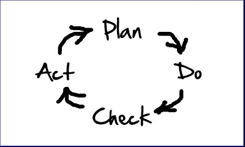


## The Cycle

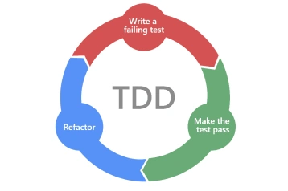


## The Cycle

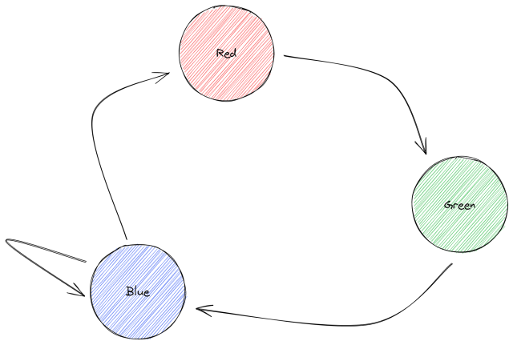


## The Red Phase

Write as *little* of a failing test as possible ...

```csharp[1-9|1|4|6|8]
public void Add_GivenAnEmptyString_ShouldReturnZero()
{
  // Arrange
  var calculator = new Calculator();
  // Act
  var result = calculator.Add(string.Empty);
  // Assert
  Assert.That(result, Is.EqualTo(0));
}
```


## The Green Phase

Write as *little* of a production code as possible, to pass the test:

```csharp
public void Add_GivenAnEmptyString_ShouldReturnZero()
{
  // Arrange
  var calculator = new Calculator();
  // Act
  var result = calculator.Add(string.Empty);
  // Assert
  Assert.That(result, Is.EqualTo(0));
}
```


## The Green Phase

```csharp[3]
public int Add(string num)
{
  return 0;
}
```


## The Blue Phase

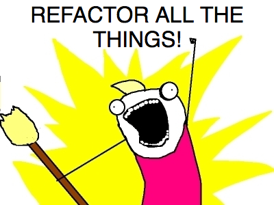


## The Blue Phase

Only refactor tests, **or** production code, never both at the same time!

```csharp
public int Add(string num)
{
  if (string.IsNullOrWhiteSpace(num))
  {
    return 0;
  }

  // more stuff here
}
```


## The Blue Phase

There should be an attempt to make the code more testable.

After each refactoring remember to run the tests.

```csharp[1-14|3|7|10]
public bool CreateCustomer(string name)
{
  var customer = new Customer();
  customer.Name = name;
  customer.State = CustomerState.Pending;

  var repository = new CustomerRepository();
  repository.Save(customer);

  var emailGateway = new EmailGateway();
  emailGateway.SendGreetings(customer);

  return true;
}
```


As a first pass, this might be acceptable, but for testability we create dependencies:

```csharp
public CustomerCreator(ICustomerRepository repository,
  IEmailGateway emailGateway)
{
  _emailGateway = emailGateway;
  _repository = repository;
}
```

```csharp[1-11|3-5]
public bool CreateCustomer(string name)
{
  var customer = new Customer();
  customer.Name = name;
  customer.State = CustomerState.Pending;

  _repository.Save(customer);
  _emailGateway.SendGreetings(customer);

  return true;
}
```


Keeping things at the same level of abstraction:

```csharp
public bool CreateCustomer(string name)
{
  var customer = CreatePendingCustomer(name);

  _repository.Save(customer);
  _emailGateway.SendGreetings(customer);

  return true;
}
```


Keeping things at the same level of abstraction:

```csharp
public bool CreateCustomer(string name)
{
  var customer = Customer.Pending().WithName(name);

  _repository.Save(customer);
  _emailGateway.SendGreetings(customer);

  return true;
}
```

### The purpose of abstraction is not to be vague, but to create a new semantic level in which one can be absolutely precise

-- Edsgar W Dijkstra


### But I see a new feature/requirement/test case while I'm refactoring ...

Add comments to help remind you

Use comments to map out a process you see

```csharp
public int Add(string numbers)
{
  // Use a whitespace check on numbers

  // Parse the numbers into an array, comma separator
  // remember to strip ending spaces
  return 0;
}
```


## Refactoring code smells

... refactor to remove smells that are starting to show ...


#### Some common smells

- Verbose Naming
- Noisy Logging
- Repetition
- Duplication
- Unnecessary code
- Mixed levels of abstraction
- Legacy coding habits
- Programming by Coincidence
- Programming by Superstition


## So what's the problem?


### When humans get involved ...

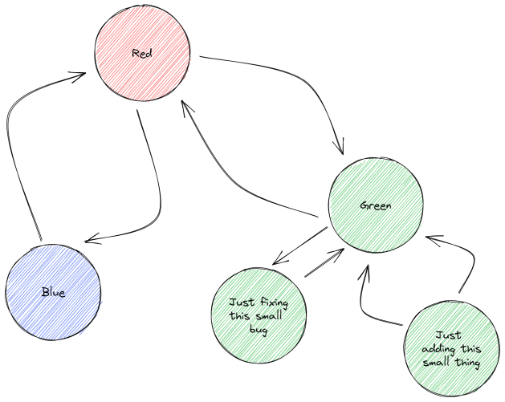


### When humans get involved ...

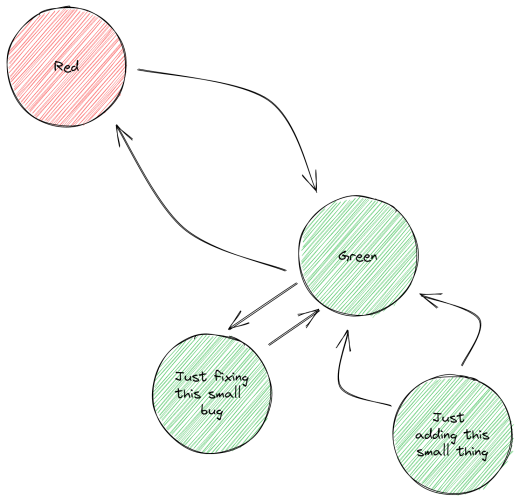


### When humans get involved ...

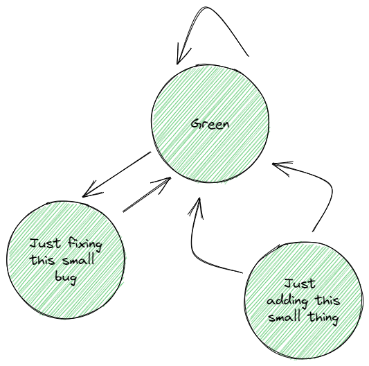


### The "Laws" try to keep us balanced


### But I just a small bug to fix ...

There are tests, the test confirmed the bug.

Always start at the `Red` phase, write a test that shows the bug, then fix the bug.

Try to enforce your own process to improve the state of the test base.


## TDD Gears

Or more practical TDD ...


## TDD Gears

Focus removed from the micro-red-green-refactor.

Gears, like car gears, used when and/as required


## TDD Gears

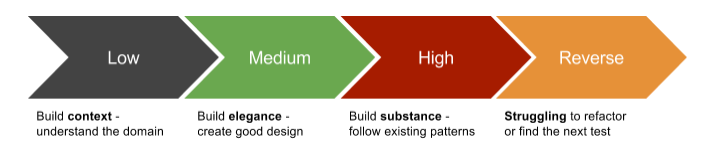

The higher the gear, the more jumps are taken.


### Low Gear

```csharp
public void Constructor_CreateCalculator()
{
  var calculator = new Calculator();
}
```

Build failure is a Red Test!


### Low Gear

Now implement the smallest amount

```csharp
public class Calculator
{
  public Calculator()
  {
  }
}
```


### Low Gear

Refactor ... nothing much to do for now ...


### Low Gear

Red stage again, update the test

```csharp
public void Add_ShouldThrowExcaption()
{
  var calculator = new Calculator();
  Assert.Throws<NotImplementedException>(() => calculator.Add());
}
```


### Low Gear

Now implement the smallest amount

```csharp
public class Calculator
{
  public Calculator()
  {
  }

  public Add()
  {
    throw new NotImplementedException();
  }
}
```


Refactor ...

```csharp
public class Calculator
{
  public Add()
  {
    throw new NotImplementedException();
  }
}
```


### Low Gear

Focus is on small, incremental steps to gain understanding of the domain.

Make small cuts into refactoring.


### High Gear

Write the test the way we expect

```csharp
public void Add_GivenAnEmptyString_ShouldReturnZero()
{
  // Arrange
  var calculator = new Calculator();
  // Act
  var result = calculator.Add(string.Empty);
  // Assert
  Assert.That(result, Is.EqualTo(0));
}
```

Yes, this will fail for multiple reasons.


### High Gear

Write the class

```csharp
public class Calculator
{
  public int Add(string numbers)
  {
    return 0;
  }
}
```


### High Gear

Makes bigger steps and assumes higher understanding of domain.

Makes use of copy-paste techniques, etc. Can lead to the most number of mistakes and missed cases.

Always engage BRAIN!


### Reverse

If you hit a block, reverse.

Refactor step failures or refactoring too far.

Use `git commit` to your advantage before starting a refactor.


## Tests are not isolated, or are they?

Tests have dependencies, how do we deal with those dependencies


## Dealing with the System Under Test

System Under Test or `SUT` is known as the "black box" we want to test.


Consider:

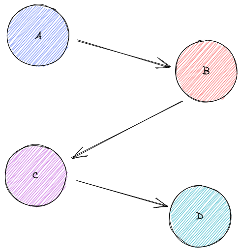


We choose where we should make a "fake" component.

As deep as possible, use concrete objects.


## Dependencies

Test Doubles is the collective noun for:

- Dummy
- Stub
- Spy
- Mock
- Fake

Most frameworks provide these built in.


#### The Spy

For monitoring a set of calls

#### The Stub

For hardcoded returns for function calls

#### The Mock

Combines stub and spy

#### The Fake

Contains a real-like implementation


### But test require data!

Tests have code dependencies and data dependencies.


### Keep your tests clean

Use the GoF creation patterns:

- Builders
- Factory methods

Use the same refactoring techniques as in the production code

Give your test data names and single point of code to change when data is shared.


### Creation Patterns

Builders create objects they are meant to represent

```csharp
public class AppleManagedFundBuilder
{
  private decimal _v;

  public AppleManagedFundBuilder WithValue(decimal v)
  {
    _v = v;
    return this;
  }

  public AppleManagedFund Build()
  {
    return new AppleManagedFund { Value: _v };
  }
}
```


### Creation Patterns

Compose Builders, and builders in builders

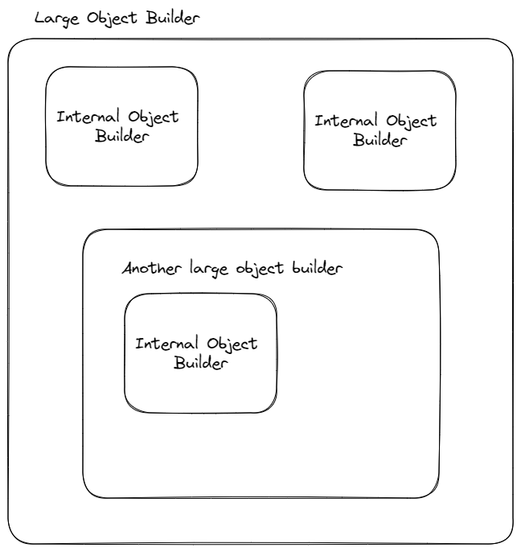


### Creation Patterns

Factory methods can create objects/data based on a named set.

Test Mothers (or Object Mothers) are static classes containing a given way of creating a test data set

```csharp
public static class TestAccountMother
{
  public static AccountBuilder AnAppleManagedFundAccountWith100Units()
  {
    return new AccountBuilder()
      .WithManagedFund(new AppleManagedFundBuilder().WithValue(100m));
  }
}
```


## Warnings

- Factory methods should not have default arguments

Builders can have defaults, Factory methods can build defaults, but should not be part of signature

- Factory methods should not have optional parameters

The tests and test data should be as deterministic as possible


## So


## Using TDD "incorrectly"

- Failing into the traps of micro-red-green-green-green

- Using TDD for the wrong types of tests (e.g. UI tests)


## Fragile tests

Or why TDD is painful...

Consider:
```csharp[6-7]
public void GetById_returns_an_order()
{
    var repository = new OrderRepository();

    repository.GetById(5);
    Assert.That(repository.SqlStatement,
      Is.EqualTo("SELECT * FROM dbo.[Order] WHERE OrderID = 5"));
}
```

Tests can be too low level, enforce order of calls, etc.


## Tests matching the production code

The test cases:

- Year not divisible by 4 are not leap years
- Years divisible by 4 but not 100 are leap years
- Years divisible by 100 but not by 400 are not leap years
- Years divisible by 400 are leap years


Implementation:

```csharp
public static bool IsLeapYear(int year)
{
  return year % 4 == 0 && year % 100 != 0 || year % 400 == 0;
}
```


Tests:

```csharp
public class A_year_is_not_a_leap_year
{
  public void if_it_not_divisible_by_4()
  {
    Assert.That(IsLeapYear(2019), Is.False);
    Assert.That(IsLeapYear(2018), Is.False);
    Assert.That(IsLeapYear(42), Is.False);
    Assert.That(IsLeapYear(1), Is.False);
  }
}
```


```csharp[1-11|3-6]
public class A_year_is_not_a_leap_year
{
  [TestCase(2019)]
  [TestCase(2018)]
  [TestCase(42)]
  [TestCase(1)]
  public void if_it_not_divisible_by_4(int year)
  {
    Assert.That(IsLeapYear(year), Is.False);
  }
}
```


### #DO_NOT_DO_THIS

```csharp
public void is_either_a_leap_year_or_not([Range(1, 10000)] int year)
{
  Assert.That(LeapYearExpectation(year), IsLeapYear(year));
}
public static bool LeapYearExpectation(int year)
{
  return year % 4 && year % 100 != 0 || year % 400;
}
```


### The 1-to-1 test function fallacy

There is no hard rule that every public function must have at least 1 test method

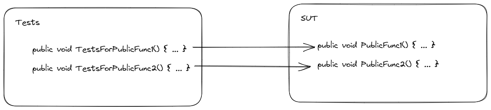


Tests can exercise multiple public endpoints

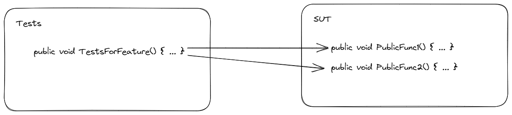


## Test Induced design failure

Or Why TDD fails ....

Step 1 is to admit that there is a problem...


#### As an system event co-ordinator, I want to store all the processed events so I can replay them on an exception


```csharp[1-10|9]
[Test]
public void Push_GivenEvent_ShouldAddToStack()
{
  // Arrange
  var eventer = new Eventer();
  // Act
  eventer.Push(new Event());
  // Assert
  // ooh dear, what do I put here, I need a RED test
}
```


I know, I'll make a Stack:

```csharp[9]
[Test]
public void Push_GivenEvent_ShouldAddToStack()
{
  // Arrange
  var eventer = new Eventer();
  // Act
  eventer.Push(new Event());
  // Assert
  Assert.That(eventer.Stack, Is.Not.Empty);
}
```


Done! Green Test!

```csharp
public class Eventer
{
  public Stack<Event> Stack { get; private set; }

  public Eventer()
  {
    Stack = new Stack<Event>();
  }

  public void Push(Event e)
  {
    Stack.Push(e);
  }
}
```


Refactor!!!

```csharp[3,10-13]
public class Eventer
{
  private Stack<Event> _stack;

  public void Push(Event e)
  {
    _stack.Push(e);
  }

  public Stack<Event> GetEventStack()
  {
    return _stack;
  }
}
```


Green Test again!

```csharp[9]
[Test]
public void Push_GivenEvent_ShouldAddToStack()
{
  // Arrange
  var eventer = new Eventer();
  // Act
  eventer.Push(new Event());
  // Assert
  Assert.That(eventer.GetEventStack(), Is.Not.Empty);
}
```


Next ...

```csharp
[Test]
public void Pop_RemovingTheLastEvent_MakeTheStackEmpty()
{
  // Arrange
  var eventer = new Eventer();
  // Act
  eventer.Push(new Event());
  var event = eventer.Pop();
  // Assert
  Assert.That(eventer.GetEventStack(), Is.Empty);
}
```


Final class has test induced design failure:

```csharp[1-13|9-12]
public class Eventer
{
  public Stack<Event> _stack;

  public void Push(Event e) { /* ... */ }

  public Event Pop() { /* ... */ }

  public Stack<Event> GetEventStack()
  {
    return _stack;
  }
}
```


## Reduce coupling

Fragile tests are a result of too much coupling.

Too much internal knowledge of the implementation in the test.


## I can see where this is going, I'm going to make a Thing-a-ma-bob!

Writing the simplest code allows you to see the necessary abstractions before jumping to a solution

Table based algorithms vs Flow control


#### The real problem is that programmers have spent far too much time worrying about efficiency in the wrong places and at the wrong times; premature optimization is the root of all evil (or at least most of it) in programming.

-- Donald Kunth


## But what about dependencies?


#### The disconnected problem, or over mocking...


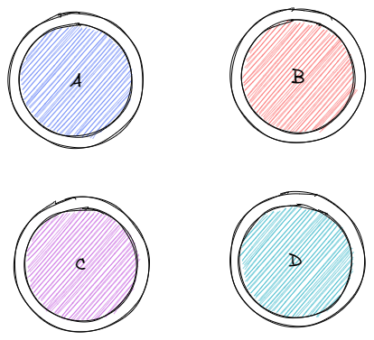

We isolate each module, so we gain isolation, but now there are more tests, duplicated tests and we're never sure that the modules are connected to each other correctly.


## BDD and TDD


### Behavior Driven development

BDD focuses on project communication

BDD should be designed around the behavior a user expects to experience when interacting with it


### Connection to TDD

BDD combines, augments and refines unit testing

TDD can be used to drive out functional requirements

The test cases should focus on the expected behavior of the system more than the number of test cases


### TDD and BDD work together

Define a test first - driven by the specification, and what behavior should do

Use TDD cycle to drive out implementation


### BDD Flow

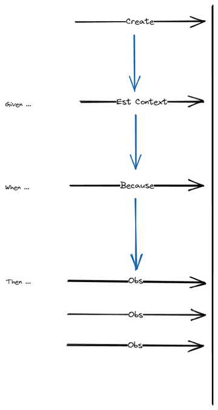


## Where to from here ...

Keep learning

Practise skills (e.g. practise kata's, refactoring exercises)

Listen/Watch conference talks on testing techniques
